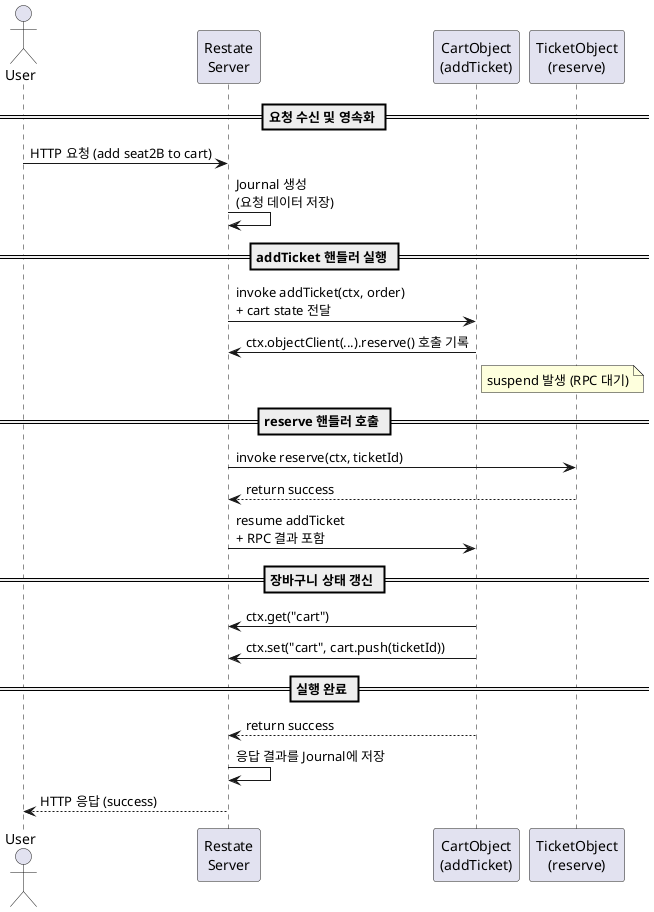

# Restate 위키: Durable Execution

> [docs.restate.dev](https://docs.restate.dev/concepts/durable_execution)

## 목차
1. 개요
2. Durable Execution 개념
3. 전체 실행 흐름
4. 코드 예시
5. 상태 변화 요약
6. 시퀀스 다이어그램 (PlantUML)

---

## 1. 개요

**Restate**는 클라우드 기반의 서버리스 애플리케이션에서 **내결함성(fault-tolerance)**을 제공하기 위해 **Durable Execution** 메커니즘을 사용합니다. 이 기능은 비동기 코드의 중단 지점을 기억하고, 장애 발생 시 해당 지점부터 재시작할 수 있도록 지원합니다.

본 문서에서는 특히 **Durable Execution의 전체 흐름**을 중심으로, 실제 애니메이션 예제(극장 티켓 예약 시나리오)를 바탕으로 상세히 설명합니다.

---

## 2. Durable Execution 개념

| 개념 | 설명 |
|------|------|
| **Durable Execution** | 코드 실행 중간 상태를 저장하여, 실패 시 그 지점부터 재실행 가능하도록 하는 메커니즘 |
| **Journal** | 각 실행 단계의 입력/출력 정보를 저장하는 로그. 재실행 시 참고됨 |
| **Virtual Object** | 상태(K/V)를 갖는 Restate 객체. 예: CartObject, TicketObject |
| **Suspend/Resume** | RPC 등 비동기 처리 중 일시 중단(suspend) 후 결과 수신 시 복귀(resume) |

---

## 3. 전체 실행 흐름 (Restate Durable Execution)

### 📌 시나리오
사용자 Joe가 "seat2B" 좌석을 장바구니에 추가하는 요청을 보냅니다.

### 🧭 단계별 흐름

| 단계 | 설명 | 상태 변화 |
|------|------|------------|
| ① 요청 도착 | Joe의 HTTP 요청 도착 | cart = [] |
| ② 요청 영속화 | 요청이 Journal에 기록됨 | Journals = [addTicket 요청] |
| ③ 핸들러 호출 | addTicket 핸들러 실행 + cart 상태 전달 | - |
| ④ ctx 호출 기록 | ticketManager.reserve() 호출 → journal에 기록 | - |
| ⑤ RPC 호출 | TicketObject.reserve() 호출 | CartObject suspend |
| ⑥ journal 생성 | reserve 호출을 위한 journal 생성 | TicketObject 실행 중 |
| ⑦ reserve 실행 | TicketObject 응답 반환 | success = true |
| ⑧ 응답 반영 | RPC 응답 → addTicket 핸들러로 전달 | journal에 기록됨 |
| ⑨ 실행 재개 | CartObject resume | - |
| ⑩ cart 조회 | ctx.get("cart") 호출 | cart = [] |
| ⑪ 상태 갱신 | ctx.set("cart", [..., seat2B]) | cart = [seat2B] |
| ⑫ 실행 완료 | 핸들러 종료, 결과 저장 | Journals = 최종 완료 상태 |
| ⑬ 응답 전송 | Restate가 결과 응답 반환 | 응답 완료 |

---

## 4. 코드 예시

```javascript
// CartObject
async function addTicket(ctx, order) {
  const success = await ctx
    .objectClient(ticketManager, ticketId)
    .reserve();

  if (success) {
    const cart = await ctx.get("cart");
    ctx.set("cart", cart.push(ticketId));
  }

  return success;
}

// TicketObject
async function reserve(ctx, ticketId) {
  // 예약 가능 여부 확인
  return success;
}
```

---

## 5. 상태 변화 요약

| 시점 | cart 상태 | 설명 |
|------|-----------|------|
| 요청 이전 | `[]` | 초기 상태 |
| 예약 성공 후 | `[seat2B]` | 티켓이 성공적으로 추가됨 |

---

## 6. 시퀀스 다이어그램 (PlantUML)



---

## 🔚 마무리
Restate의 Durable Execution은 단순한 retry가 아닌 **정확한 지점 복원(replay)**을 지원함으로써, 분산 환경에서도 **신뢰성과 일관성을 보장**합니다.

이러한 메커니즘은 **상태 기반 객체 지향 모델**과 **journal 기반 로깅**을 결합하여 서버리스 아키텍처에도 강력한 내결함성을 제공합니다.